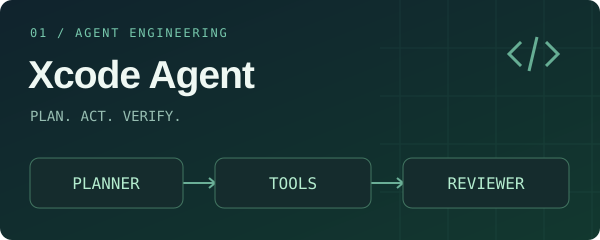
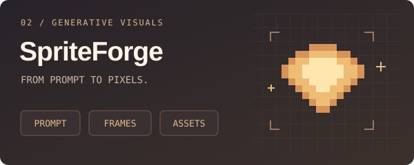

  

  <strong>把模型能力，写进能运行的工具。</strong> 
  AI 方向研究生 · 用 Java 探索编程 Agent，用 Python 构建视觉生成工作流。

  <a href="#精选项目">精选项目</a> &nbsp; / &nbsp;
  <a href="#设计笔记">设计笔记</a> &nbsp; / &nbsp;
  <a href="https://github.com/vanishValley?tab=repositories">全部仓库</a>

 

## 精选项目

<table>
<tr>
<td width="50%" valign="top">

<h3>Xcode Agent</h3>

<strong>从工具调用，到完整的编程任务。</strong>

Java 17 实现的终端编程助手，探索 Agent 如何规划、协作、记住上下文，并验证执行结果。

<ul>
  <li>ReAct、DAG 规划与多 Agent 协作</li>
  <li>上下文管理、长期记忆、Skills 与 MCP</li>
  <li>人工审批、取消恢复、观测与独立验收</li>
</ul>

<code>Java</code> <code>MCP</code> <code>OpenTelemetry</code>

<a href="https://github.com/vanishValley/Xcode">查看项目 →</a> &nbsp; <a href="https://github.com/vanishValley/Xcode#快速开始">运行指南</a>

</td>
<td width="50%" valign="top">

<h3>SpriteForge</h3>

<strong>从一句描述，到可下载的游戏素材。</strong>

AI 驱动的 2D 素材生成工具，把提示词、图像与视频生成、后处理和素材导出接成一条工作流。

<ul>
  <li>角色、场景、道具、UI 与特效生成</li>
  <li>视频抽帧、背景移除与精灵表拼接</li>
  <li>生成任务管理、PNG 与 JSON 打包导出</li>
</ul>

<code>Python</code> <code>FastAPI</code> <code>OpenCV</code>

<a href="https://github.com/vanishValley/SpriteForge">查看项目 →</a> &nbsp; <a href="https://github.com/vanishValley/SpriteForge#快速开始">运行指南</a>

</td>
</tr>
</table>

 

## 设计笔记

除了项目能做什么，我也关心它为什么这样设计。这里是几个可以直接读到实现细节的入口：

- **协作与执行** — [多 Agent 如何分工、传递信息和协调工作区](https://github.com/vanishValley/Xcode/blob/main/docs/team-mode-implementation.md)
- **记忆与上下文** — [会话、长期记忆和上下文压缩如何配合](https://github.com/vanishValley/Xcode/blob/main/docs/memory_design.md)
- **评测与验证** — [如何独立检查 Agent 是否真正完成任务](https://github.com/vanishValley/Xcode/blob/main/docs/agent-evaluation-design.md)
- **视觉处理** — [从视频抽帧到精灵表的处理代码](https://github.com/vanishValley/SpriteForge/blob/master/frame_extractor.py)

 

## 持续探索

**可靠的 Agent 执行** &nbsp; · &nbsp; **可复现的评测** &nbsp; · &nbsp; **生成内容的应用交付**

把功能做出来，也把失败处理、验证方式和设计取舍记录下来。

---

  对 Agent、计算机视觉或开发工具感兴趣？欢迎在项目 Issues 中交流。 
  <a href="https://github.com/vanishValley/Xcode/issues">Xcode 讨论</a> &nbsp; · &nbsp;
  <a href="https://github.com/vanishValley/SpriteForge/issues">SpriteForge 讨论</a>

